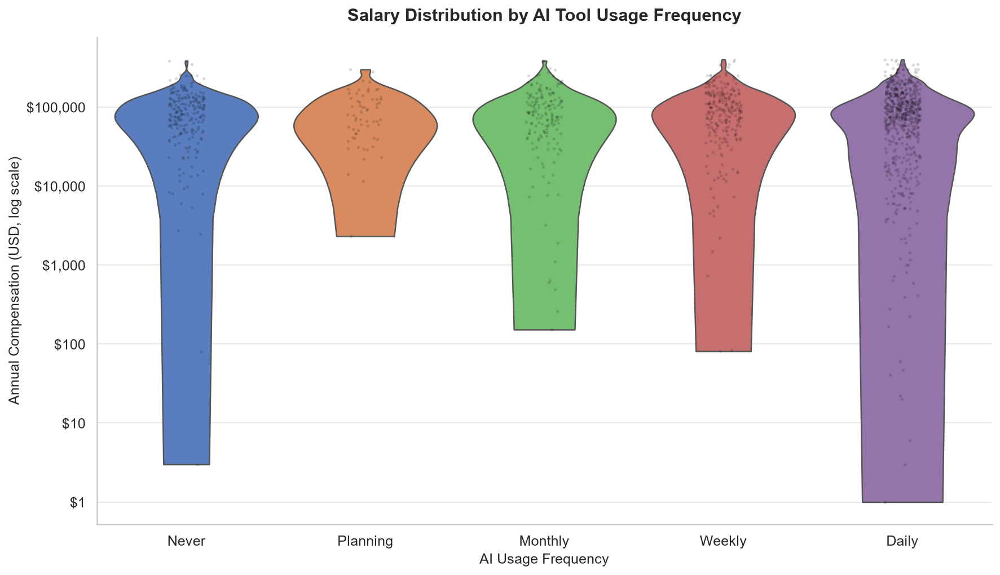
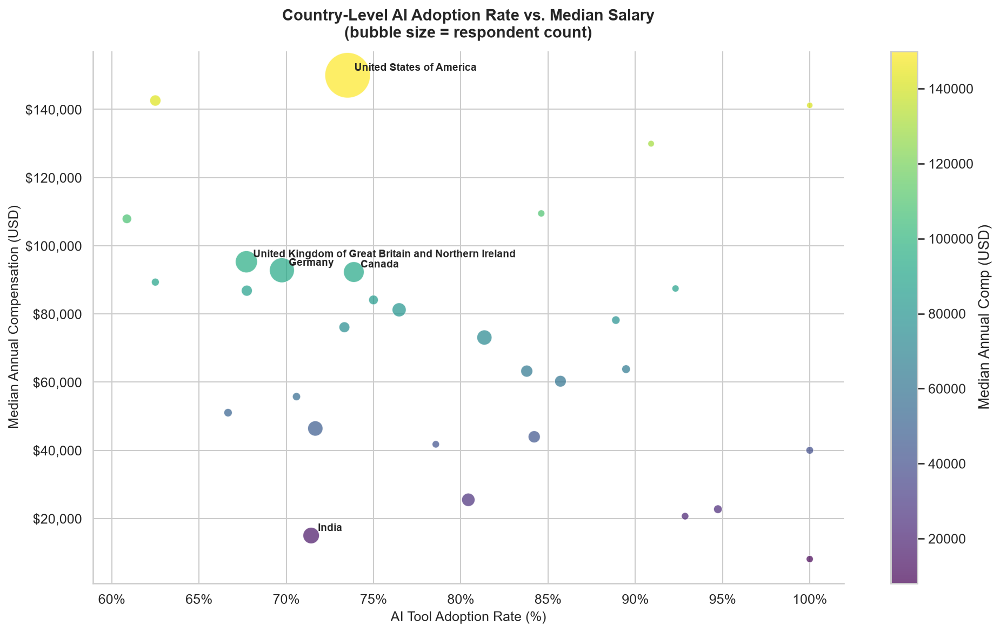
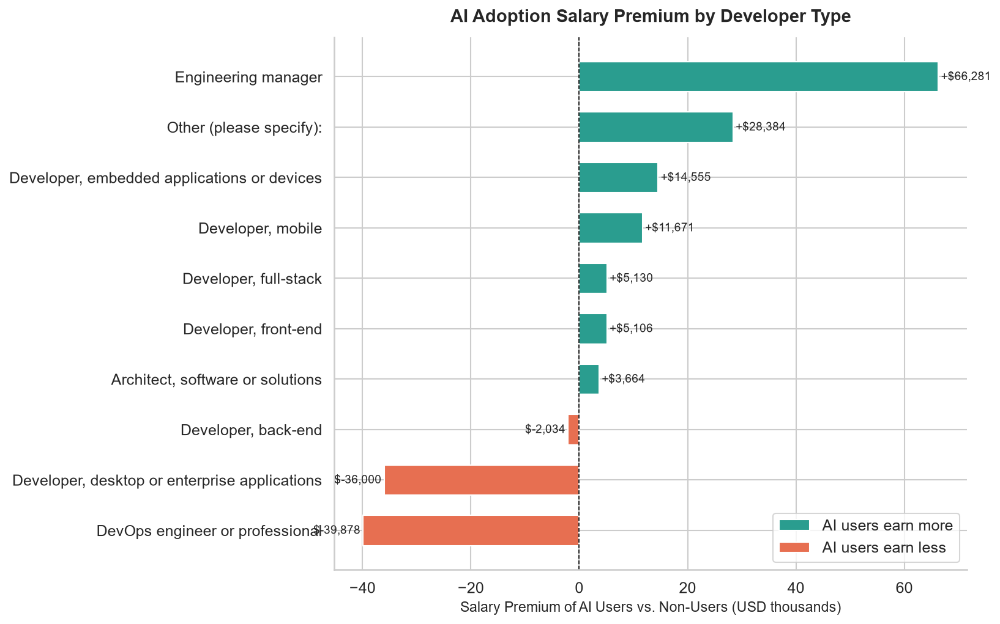
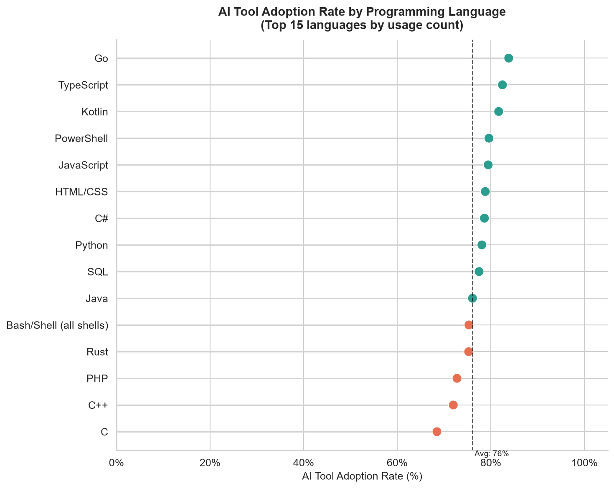
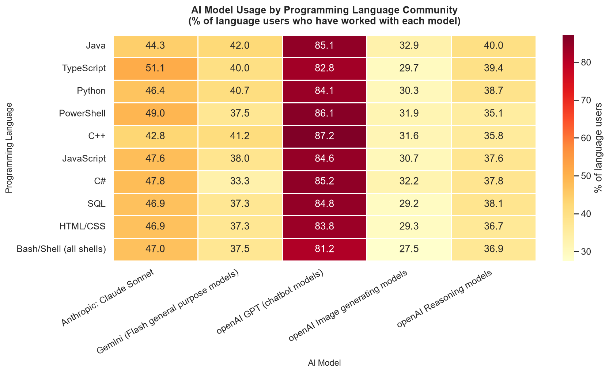
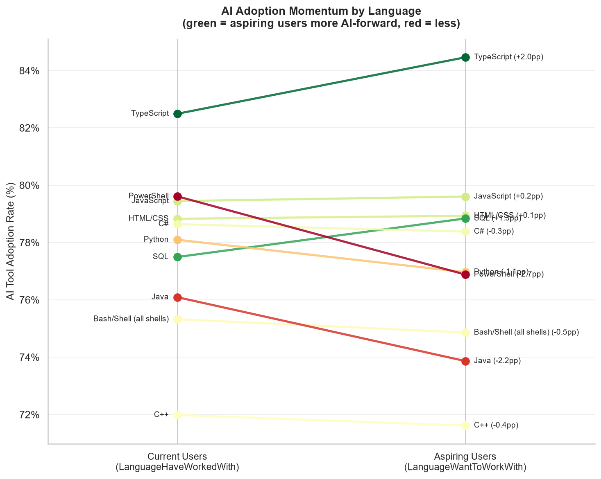

# Stack Overflow Developer Survey — EDA Portfolio

> Profiling a real-world developer survey to surface insights on **AI adoption vs. compensation** and **AI adoption vs. tech stack trends**.

**Dataset:** Stack Overflow Developer Survey 2024/2025 · 1,882 respondents · 172 columns  
**Notebook:** [`notebooks/eda.ipynb`](notebooks/eda.ipynb)  
**Tools:** Python · pandas · matplotlib · seaborn

---

## Data Quality Summary

| Metric | Value |
|--------|-------|
| Total rows | 1,882 |
| Total columns | 172 |
| Duplicate rows | 0 |
| Columns with >50% missing | ~40 (multi-select optionals) |
| ConvertedCompYearly non-null | ~1,380 (73%) |

Key numeric columns (`ConvertedCompYearly`, `YearsCode`, `WorkExp`) have 20–40% nulls — typical for optional survey questions. Multi-value columns (languages, tools) are semicolon-separated and require splitting before analysis. No duplicate rows were found.

---

## Theme 1 — AI Adoption × Compensation

### Insight 1: Salary Distribution by AI Usage Frequency



Daily AI users (873 respondents) show a notably higher and tighter salary distribution than non-users (345 respondents). The violin width reveals that non-users cluster at lower salary bands while daily users span a broader range at the upper end. The log scale exposes the full spread without being dominated by outliers.

---

### Insight 2: Country-Level AI Adoption Rate vs. Median Salary



31 countries with ≥10 respondents and non-null salary data are shown. The USA ($150K median, 74% AI adoption) and India ($15K median, 71% AI adoption) sit at opposite ends of the y-axis, illustrating that AI adoption rate alone does not determine pay — economic context dominates. A positive diagonal trend is visible among similarly-developed economies.

---

### Insight 3: AI Adoption Salary Premium by Developer Type



The salary premium for AI adoption is highly role-dependent. Engineering managers who use AI tools earn ~$66K more than their non-adopting peers — the largest positive premium. Conversely, DevOps and desktop developers show a negative premium (~-$40K and ~-$36K), suggesting that non-adopters in those roles tend to be highly-paid specialists in legacy or niche systems.

---

## Theme 2 — AI Adoption × Tech Stack

### Insight 4: AI Adoption Rate by Programming Language



Overall AI adoption across the top 15 languages is 76%. Go (83.8%), TypeScript (82.5%), and Kotlin (81.7%) lead — modern, productivity-focused ecosystems where AI assistants integrate well. C (68.5%), C++ (72%), and PHP (72.8%) trail, consistent with low-level control work and legacy codebases where AI coding assistants provide less value.

---

### Insight 5: AI Model Usage Across Language Communities



openAI GPT models dominate across every language community. TypeScript and Java communities show the broadest multi-model adoption — TypeScript developers lead Claude Sonnet usage at 51.1%, suggesting more mature and exploratory AI workflows. The heatmap reveals that GPT is the universal baseline, while secondary model adoption varies significantly by language ecosystem.

---

### Insight 6: AI Adoption Momentum — Current vs. Aspiring Users



The gaps between current and aspiring users are narrow (2–3 percentage points), signalling that AI adoption is converging toward near-universal usage across major languages. TypeScript's aspiring users are slightly more AI-forward (+2.0pp), while PowerShell (-2.7pp) and Java (-2.2pp) aspiring cohorts are slightly less so, suggesting those communities are not actively attracting new AI-native developers.

---

## Key Takeaways

1. **AI adoption salary premium is role-dependent** — Engineering managers who use AI earn ~$66K more than non-adopters; DevOps and desktop developers show the opposite pattern. Across countries, high AI adoption nations also show higher median developer salaries.

2. **Most developers use AI tools, but frequency and model diversity vary** — 76% of respondents use AI tools at some level. GPT models dominate universally, but TypeScript and Java communities explore a broader model palette, hinting at more mature AI workflows.

3. **Modern ecosystems lead AI adoption; the field is converging** — Go, TypeScript, and Kotlin communities are 10–15 percentage points ahead of C and PHP. But slope analysis shows the momentum gap is just 2–3pp, suggesting near-universal AI adoption across major languages is approaching.

---

## How to Reproduce

```bash
pip install pandas numpy matplotlib seaborn nbformat jupyter
cd notebooks
python -m jupyter notebook eda.ipynb
# Kernel → Restart & Run All
```

All figures are regenerated in `img/` on each full run. No external APIs or random seeds — output is fully deterministic.
